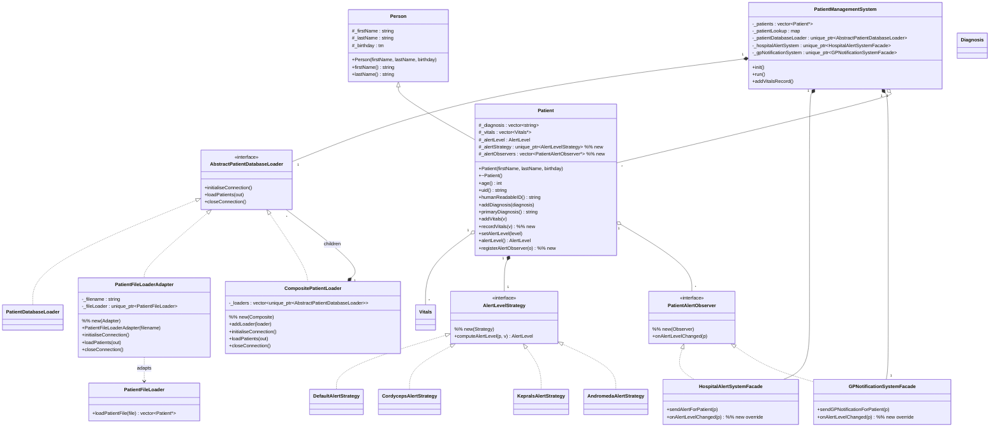
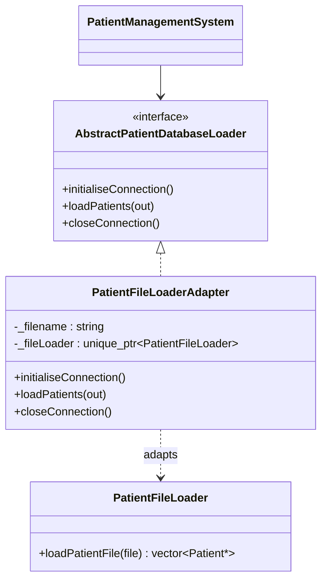
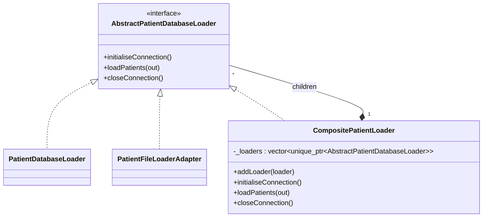
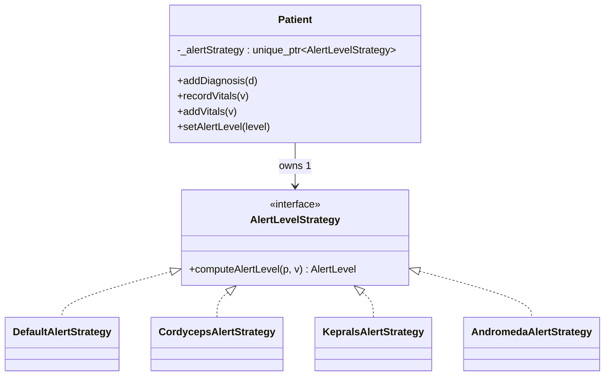
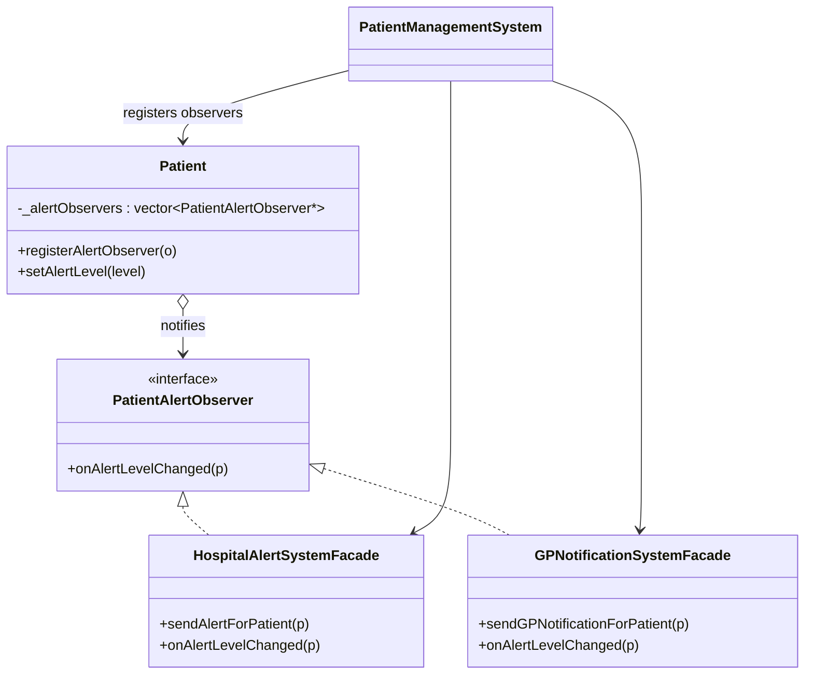

# Patient Vitals Management System — Design Document

> **Note for the student:** this document is a worked reference. Before submitting, **rewrite every section in your own words**, replace the diagrams with your own, and confirm what your course allows in terms of AI assistance — Section 9 of the UniSA Assessment policies and Assignment 2 page 10 require you to submit your own work. The commit hashes below match the worked reference repository and should be replaced with the hashes from the repo you actually submit (`git log --oneline`).

---

## 1. Final Design Class Diagram

The diagram below is rendered in Mermaid; copy it into the design document of your choice (Visio, draw.io, etc.) and re-export as a PNG/SVG. Annotations marked **(new)** identify classes/relationships added in this assignment.



**What is new in this design (highlighted with `%% new` above):**
- `PatientFileLoaderAdapter` — adapter from the unmodifiable `PatientFileLoader` to `AbstractPatientDatabaseLoader` (FR1).
- `CompositePatientLoader` — composite over `AbstractPatientDatabaseLoader` (FR2).
- `AlertLevelStrategy` interface and `DefaultAlertStrategy`, `CordycepsAlertStrategy`, `KepralsAlertStrategy`, `AndromedaAlertStrategy` concrete strategies, plus `Patient::_alertStrategy` and `Patient::recordVitals` (FR3).
- `PatientAlertObserver` interface, `Patient::_alertObservers` and `Patient::registerAlertObserver`, and the new observer responsibility on the two facades (FR4).
- `Patient::~Patient()` and `virtual ~AbstractPatientDatabaseLoader()` for correct ownership (DC4).

---

## 2. FR1 — Load patients from file

### Design pattern: Adapter

The fixed `PatientFileLoader` exposes a single function:

```50:55:PatientSystem/PatientFileLoader.h
class PatientFileLoader
{
public:
	// loads a list of patients from a file and returns a vector of those patients
	std::vector<Patient*> loadPatientFile(const std::string& file);

};
```

That signature does not match `AbstractPatientDatabaseLoader`, which uses `initialiseConnection()` / `loadPatients(out)` / `closeConnection()` and writes into an out-parameter rather than returning. Because the assignment forbids changing `PatientFileLoader.h`, the only way to plug it into the existing `PatientManagementSystem` slot is to wrap it in an adapter that *is-a* `AbstractPatientDatabaseLoader` and *has-a* `PatientFileLoader`. This is the textbook Object Adapter form of the Adapter pattern.

### Class diagram (focus on FR1)



### How it works

1. `PatientManagementSystem` is constructed with a `unique_ptr<AbstractPatientDatabaseLoader>` — the concrete loader is selected by the `make…Loader()` helpers in `PatientManagementSystem.cpp`. To run with file-only data, replace the line `_patientDatabaseLoader(makeDatabaseAndFileLoader())` with `_patientDatabaseLoader(makeFileOnlyLoader())` (the trivial one-line switch required by FR1).
2. `init()` calls `loadPatients(_patients)` on the loader. When the loader is a `PatientFileLoaderAdapter`, the adapter forwards the call to `PatientFileLoader::loadPatientFile(_filename)`, then appends the returned `vector<Patient*>` into the system's vector.
3. `PatientFileLoader::loadPatientFile` opens `patients.txt`, parses each `uid|lastname,firstname|dd-mm-yyyy|disease|vitals` line, and constructs `new Patient(...)` plus `new Vitals(...)` instances. The uid is recomputed by `Patient::uid()` and is therefore consistent with the database loader.
4. `closeConnection()` is a no-op for the adapter because file loading does not hold a long-lived resource. `initialiseConnection()` is also a no-op for the same reason — the adapter only opens the file inside `loadPatients`.
5. `PatientManagementSystem` keeps full ownership of the returned `Patient*` and frees them in its destructor.

### Git commits

- File parser, adapter, and `virtual ~AbstractPatientDatabaseLoader` were added in commit `4cf2d5d` ("Add PatientFileLoaderAdapter to load patients from file (FR1)").

---

## 3. FR2 — Load patients from file and database

### Design pattern: Composite

`PatientManagementSystem` only knows how to talk to a single `AbstractPatientDatabaseLoader`. We need it to load from the database first and the file second, and to be able to swap configurations on a single line. Building a "fan-out" loader that itself implements `AbstractPatientDatabaseLoader` lets the rest of the system stay unchanged — that is the Composite pattern: a container that shares the leaf interface so clients treat one element and a tree of elements identically.

### Class diagram (focus on FR2)



### How it works

1. `CompositePatientLoader` owns a `vector<unique_ptr<AbstractPatientDatabaseLoader>>` of children. Children can be anything implementing the loader interface — including another composite, although we do not need that here.
2. `addLoader(child)` takes ownership of the child via `std::move`. The order of insertion defines the iteration order during loading, which matters because the assignment requires the database to load before the file.
3. The three `AbstractPatientDatabaseLoader` operations on the composite simply iterate over the children and invoke the same operation on each.
4. `PatientManagementSystem` selects its loader through the `makeDatabaseAndFileLoader()` helper:

```31:37:PatientSystem/PatientManagementSystem.cpp
	std::unique_ptr<AbstractPatientDatabaseLoader> makeDatabaseAndFileLoader()
	{
		auto composite = std::make_unique<CompositePatientLoader>();
		composite->addLoader(std::make_unique<PatientDatabaseLoader>());
		composite->addLoader(std::make_unique<PatientFileLoaderAdapter>("patients.txt"));
		return composite;
	}
```

5. The default in the constructor's initialiser list is `_patientDatabaseLoader(makeDatabaseAndFileLoader())`, satisfying "the repository must default to database+file". Switching to `makeDatabaseOnlyLoader()` or `makeFileOnlyLoader()` is a literal one-line change.

### Git commits

- Composite class and PMS wiring were added in commit `b9ea418` ("Compose database and file loaders via CompositePatientLoader (FR2)").

---

## 4. FR3 — Calculate the patient alert levels

### Design pattern: Strategy

Each disease defines a different algorithm for turning a `Vitals` reading into an `AlertLevel`. Encoding all of these as a `switch` on diagnosis inside `Patient` would tightly couple `Patient` to every disease and would force every change to that one method. The Strategy pattern factors each algorithm into its own class with a uniform interface and lets `Patient` hold a polymorphic pointer to the algorithm it should use, selected when its primary diagnosis is set.

### Class diagram (focus on FR3)



### How it works

1. `AlertLevelStrategy` declares `computeAlertLevel(const Patient&, const Vitals&)` returning an `AlertLevel`.
2. Four concrete strategies implement the algorithms from Table 1 of the brief: respiratory rate thresholds for Cordyceps, age-aware heart-rate thresholds for Kepral's, blood-pressure thresholds for Andromeda, and a `DefaultAlertStrategy` that always returns `Green` for diagnoses we don't have a rule for.
3. `Patient` stores `unique_ptr<AlertLevelStrategy>` (default-constructed to a `DefaultAlertStrategy`). When `Patient::addDiagnosis(d)` is called for the first time it inspects `d` and replaces `_alertStrategy` with the matching concrete strategy.
4. To honour the rule "alert level must not be calculated for historical patient data", I split vitals ingestion into two operations:
   - `Patient::addVitals(const Vitals*)` simply appends. Loaders use this so loading from a file or database does not produce alerts.
   - `Patient::recordVitals(const Vitals*)` appends *and* runs `_alertStrategy->computeAlertLevel(*this, *v)`, then forwards the result to `setAlertLevel`. `PatientManagementSystem::addVitalsRecord` calls `recordVitals` for every reading entered through the menu.
5. `Patient::~Patient()` was added so the patient now `delete`s its owned vitals, removing a leak that existed in the baseline (DC4).

### Git commits

- Strategy interface, four concrete strategies, `Patient` strategy/`recordVitals` integration, and the destructor were added in commit `bec3e2a` ("Compute disease-specific alert levels via AlertLevelStrategy (FR3)").

---

## 5. FR4 — Alert the hospitals and GPs

### Design pattern: Observer

The two facades must react *immediately* whenever a patient's alert level changes, but `Patient` should not depend on the facades — that would invert the existing dependency direction (PMS owns the facades; Patient is owned by PMS). The Observer pattern is the natural fit: `Patient` becomes a subject that publishes alert level changes through a small abstract subscriber interface; the facades implement that interface and are subscribed to each patient by `PatientManagementSystem` at startup.

### Class diagram (focus on FR4)



### How it works

1. `PatientAlertObserver` is a small pure-virtual interface with one method, `onAlertLevelChanged(Patient*)`.
2. Both facades (`HospitalAlertSystemFacade`, `GPNotificationSystemFacade`) inherit from `PatientAlertObserver` and forward `onAlertLevelChanged` to their existing public `sendAlertForPatient` / `sendGPNotificationForPatient` operations. The facades retain their existing internal threshold logic (the hospital only acts on Red, the GP only acts on > Orange), so each subscriber decides whether the new state warrants action.
3. `Patient` keeps a `vector<PatientAlertObserver*>` of (non-owning) subscribers and exposes `registerAlertObserver`. After `setAlertLevel(level)` updates the internal state and prints the existing console message, it iterates over the observers and calls `onAlertLevelChanged(this)` so the change is published synchronously and immediately.
4. `PatientManagementSystem::init()` registers both facades on every patient as soon as patients are loaded:

```70:79:PatientSystem/PatientManagementSystem.cpp
void PatientManagementSystem::init()
{
	_patientDatabaseLoader->loadPatients(_patients);
	for (Patient* p : _patients) {
		_patientLookup[p->uid()] = p;

		// Subscribe the hospital and GP facades to alert level changes for
		// every patient. Both facades implement PatientAlertObserver and
		// individually decide whether the new level warrants action.
		p->registerAlertObserver(_hospitalAlertSystem.get());
		p->registerAlertObserver(_gpNotificationSystem.get());
	}
}
```

5. Because the facades are owned by `PatientManagementSystem` and patients are destroyed in the same destructor, the lifetime of the observers strictly outlives the lifetime of the subjects, so the raw pointers in `_alertObservers` are safe.

### Git commits

- Observer interface, facade overrides, Patient subject behaviour, and PMS subscription were added in commit `b3b6d09` ("Notify hospital and GP facades of alert changes via Observer (FR4)").

---

## 6. Design constraint compliance

| Constraint | How it is satisfied |
|---|---|
| DC1 Compiles | The Visual Studio 2022 solution builds clean as `Debug|x64` and `Release|x64`. |
| DC2 STL collections | `std::vector`, `std::map`, `std::unique_ptr`, `std::string` are used exclusively. |
| DC3 Dynamic memory | `Patient` and `Vitals` are heap-allocated by loaders; loaders, strategies, and the composite are all owned via `std::unique_ptr`. |
| DC4 Cleanup | `PatientManagementSystem` deletes its `Patient*` collection; `Patient::~Patient()` deletes its `Vitals*` collection; loaders/strategies/observers are owned by smart pointers. `AbstractPatientDatabaseLoader` was given a virtual destructor so derived loaders are correctly destroyed through the base pointer. |
| DC5 References | All public functions take large objects by `const&` (`Patient&`, `Vitals&`, `std::string&`, `std::vector<Patient*>&`). |
| DC6 Pointer collections | `_patients` (PMS), `_vitals` (Patient), and the composite's `_loaders` are all explicitly cleaned up. |
| DC7 const | All non-mutating member functions are marked `const` (`age`, `uid`, `humanReadableID`, `primaryDiagnosis`, `vitals`, `alertLevel`, `printPatients`, `printWelcomeMessage`, `printMainMenu`, every `computeAlertLevel`). |
| DC8 Initialiser lists | All constructors (`Patient`, `PatientFileLoaderAdapter`, `PatientManagementSystem`) initialise members in their initialiser lists. |
| DC9 Style | Existing brace style preserved; new files use the same conventions. |
| DC10 No external libs | Only C++ standard library headers are used. |

---

## 7. Build & run instructions

### Visual Studio 2022 (recommended)

1. Open `PatientSystem.sln`.
2. Choose `Debug | x64` (or `Release | x64`).
3. Press `Ctrl+F5` to build and run without debugging, or `F5` to debug.

`patients.txt` is automatically copied next to the EXE by a post-build step in the project, so the EXE works whether you launch it from Visual Studio or from a terminal.

### Command line (PowerShell)

```powershell
$msbuild = "C:\Program Files\Microsoft Visual Studio\2022\Community\MSBuild\Current\Bin\MSBuild.exe"
& $msbuild PatientSystem.sln /p:Configuration=Debug /p:Platform=x64 /v:minimal /nologo

# Run the resulting executable
Push-Location x64\Debug
.\PatientSystem.exe
Pop-Location
```

### Switching loader configurations

Open `PatientSystem/PatientManagementSystem.cpp` and change the single line in the constructor's initialiser list:

```cpp
_patientDatabaseLoader(makeDatabaseAndFileLoader())     // default (FR2 requirement)
_patientDatabaseLoader(makeDatabaseOnlyLoader())        // database only
_patientDatabaseLoader(makeFileOnlyLoader())            // file only (FR1)
```
